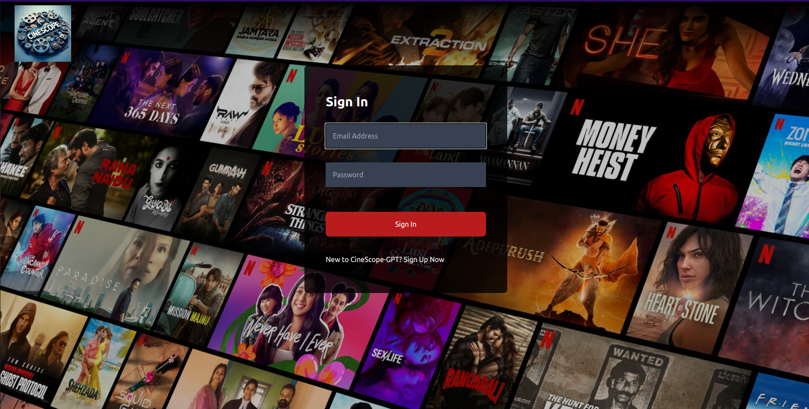
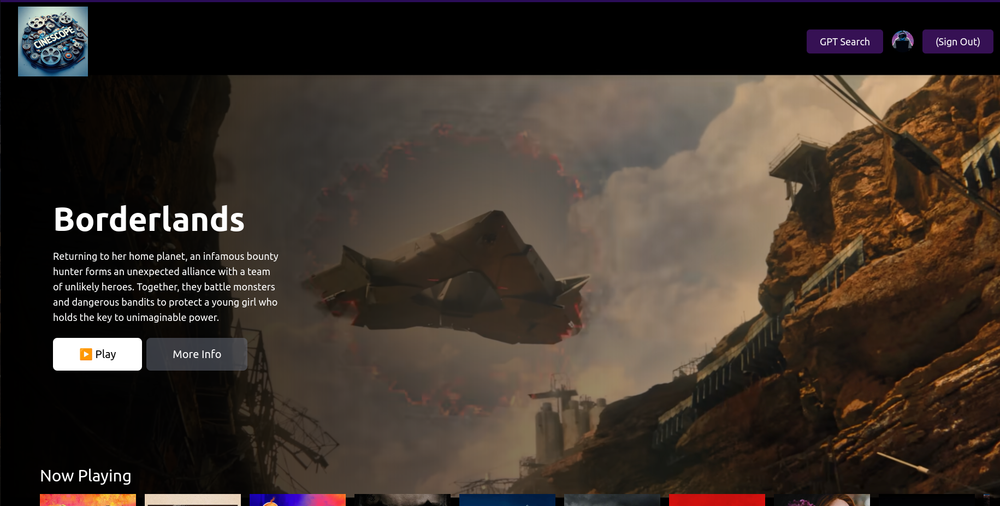
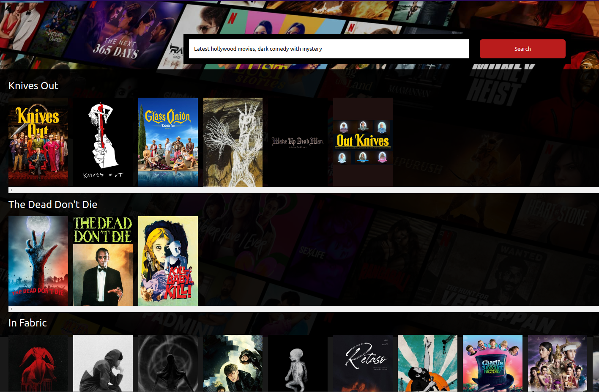
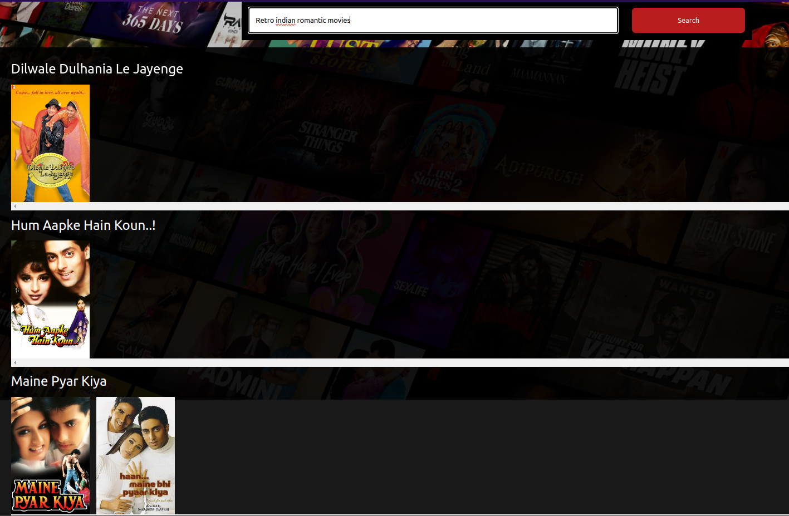

# [CineScope-GPT](https://cinescope-gpt.web.app/)

CineScope-GPT is an advanced movie recommendation web app designed to offer a more personalized and flexible search experience using the power of GPT-3.5 Turbo. Unlike traditional OTT platforms such as Netflix or Prime Video, CineScope-GPT allows for highly customized and complex searches, enabling users to discover movies based on deeper preferences and requirements.

## 🌟 Why CineScope-GPT?
Searching for movies on popular OTT platforms is often limited by rigid search filters and basic recommendations. CineScope-GPT leverages OpenAI's GPT-3.5 Turbo model to break these limitations by allowing you to input natural language queries that capture intricate preferences, themes, or niche genres—delivering precise and personalized movie recommendations powered by the vast TMDB database.

## 🔑 Features Overview

### 🔐 Login / Sign Up 

- **User Authentication**: Users can securely sign up and log in using Firebase Authentication.
- **Form Validation**: Ensures the accuracy of inputs during registration and login.

### 🎬 Browse Page

- **Now Playing Movies**: Fetches and displays a curated list of movies currently playing, powered by the **TMDB API**.
- **Main Movie Feature**: Showcases the latest movie with background trailer autoplay and mute functionality.
- **Movie Cards & Lists**: Multiple movie suggestion lists to help users browse movies based on different categories (e.g., popular, trending).

### 🤖 GPT-Powered Movie Search

- **Search Bar**: Users can input natural language queries, asking for highly specific or personalized movie suggestions.
- **GPT-3.5 Turbo**: We use **OpenAI’s GPT-3.5 model** to interpret complex search requests, offering recommendations beyond the standard filters provided by traditional platforms.
- **Integration with TMDB**: Movie suggestions fetched from TMDB based on GPT-generated results are presented in an intuitive format.

### - Prompt-1: "*Latest Hollywood movies, dark comedy with mystery*"

### - Prompt-2: "*Retro Indian Romantic movies*"

### 🚀 How it Works
The app uses OpenAI API keys to query the GPT-3.5 Turbo model.
User search queries are processed by GPT to generate movie suggestions, which are then matched against TMDB’s extensive database.
A clean and simple UI allows users to view movie details, trailers, and additional suggestions based on their interests.

### 🛠️ Technologies Used
- **React**: For building a fast and responsive user interface.
- **TailwindCSS**: For styling and layout.
- **Firebase**: For authentication and hosting the app.
- **Redux**: For managing user and movie state across the app.
- **OpenAI GPT-3.5 Turbo**: To handle the advanced movie search functionality.
- **TMDB API**: For fetching up-to-date movie data, trailers, and other media assets.

### 🌱 What’s Next?

- **Further Personalization**: Introducing user preferences and watch history to fine-tune recommendations.
- **Additional Search Features**: Adding filters for more refined searches (e.g., release date, genres, etc.).
- **UI/UX Enhancements**: Further polishing the UI to enhance user experience.

Feel free to explore [CineScope-GPT](https://cinescope-gpt.web.app/) and get personalized movie recommendations like never before !!

